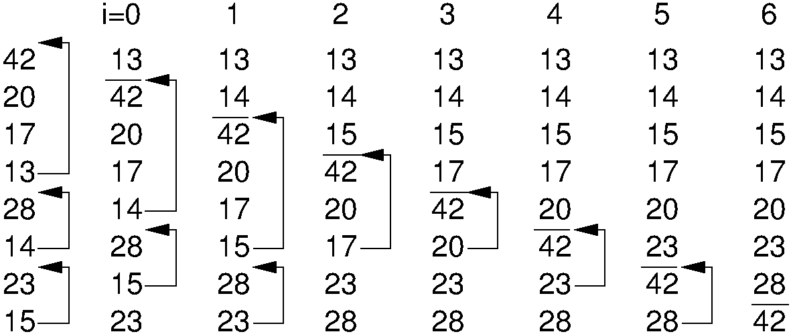

.. avmetadata:: Bubble Sort
   :author: Cliff Shaffer
   :prerequisites: Sorting, InsertionSort
   :topic: Sorting
   :short_name: BubbleSort

.. _BubbleSort:

.. index:: ! Bubble Sort

Bubble Sort
===========

Our next sorting algorithm is called :dfn:`Bubble Sort`.
Bubble Sort is often taught to novice programmers in
introductory computer science courses.
This is unfortunate, because Bubble Sort has no redeeming features
whatsoever.
It is a relatively slow sort, it is no easier to understand than
Insertion Sort, it does not correspond to any intuitive counterpart in
"everyday" use, and it has a poor best-case running time.
However, Bubble Sort can serve as the inspiration for a better sorting
algorithm that will be presented in
Module :ref:`Selection Sort <SelectionSort>`.

Bubble Sort consists of a simple double ``for`` loop.
The first iteration of the inner ``for`` loop moves
through the record array from bottom to top, comparing adjacent keys.
If the lower-indexed key's value is greater than its higher-indexed
neighbor, then the two values are swapped.
Once the smallest value is encountered, this process will cause it
to "bubble" up to the top of the array.
The second pass through the array repeats this process.
However, because we know that the smallest value reached the top
of the array on the first pass, there is no need to compare the top
two elements on the second pass.
Likewise, each succeeding pass through the array compares adjacent
elements, looking at one less value than the preceding pass.
An implementation is as follows.

.. codeinclude:: Sorting/Bubblesort/Bubblesort.pde 
   :tag: Bubblesort        

   <ODSAfig "BubbSort" />
   An illustration of Bubble Sort.
   Each column shows the array after the iteration with the indicated
   value of ``i`` in the outer ``for`` loop.
   Values above the line in each column have been sorted.
   Arrows indicate the swaps that take place during a given iteration.

The following visualization puts it all together.

.. avembed:: AV/Sorting/bubblesort-av.html

.. TODO::

   Exercise:

   Given: An array where some element X is highlighted. Everthing to the
   right of X is sorted (and bigger), and everything to the left is
   constrained random (must be a legal state for this position in
   bubble sort processing).

   Question: In this array, the highlighted element is the current
   element to be processed in the next pass of Bubble Sort. Show the
   array after the element has been placed in its proper position (and
   other elements moved as necessary).

.. TODO::

   Create proficiency exercise for Bubble Sort.

Determining Bubble Sort's number of comparisons is easy.
Regardless of the arrangement of the values in the array, the number
of comparisons made by the inner ``for`` loop is always
:math:`i`, leading to a total cost of

.. math::
   \sum_{i=1}^n i \approx n^2/2 = \Theta(n^2).

Bubble Sort's running time is roughly the same
in the best, average, and worst cases.

The number of swaps required depends on how often a
value is less than the one immediately preceding it in the array.
We can expect this to occur for about half the comparisons in the
average case, leading to :math:`\Theta(n^2)` for the
expected number of swaps.
The actual number of swaps performed by Bubble Sort will be identical
to that performed by
Insertion Sort.

.. avembed:: Exercises/BubbleSortMC.html
   :showbutton: hide
   :title: Question 1
