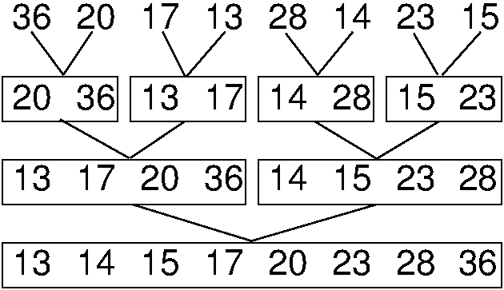

.. This file is part of the OpenDSA eTextbook project. See
.. http://algoviz.org/OpenDSA for more details.
.. Copyright (c) 2012 by the OpenDSA Project Contributors, and
.. distributed under an MIT open source license.

.. avmetadata:: Mergesort
   :author: Cliff Shaffer
   :prerequisites: Sorting
   :topic: Sorting
   :short_name: Mergesort

.. _Mergesort:

.. include:: JSAVheader.rinc

.. index:: ! Mergesort

Mergesort Concepts
==================

A natural approach to problem solving is divide and conquer.
In terms of sorting, we might consider breaking the list to be sorted
into pieces, process the pieces, and then put them back together
somehow.
A simple way to do this would be to split the list in half, sort
the halves, and then merge the sorted halves together.
This is the idea behind Mergesort.

Mergesort is one of the simplest sorting algorithms conceptually,
and has good performance both in the asymptotic 
sense and in empirical running time.
Surprisingly, even though it is based on a simple concept,
it is relatively difficult to implement in practice.
Here is a pseudocode sketch of Mergesort::

    List mergesort(List inlist) {
      if (inlist.length() <= 1) return inlist;;
      List L1 = half of the items from inlist;
      List L2 = other half of the items from inlist;
      return merge(mergesort(L1), mergesort(L2));
    }

Figure :num:`Figure #MergeSortFig` illustrates Mergesort.

.. _MergeSortFig:

   Mergesort example.
   The first row shows eight numbers that are to be sorted.
   Mergesort will recursively subdivide the list into
   sublists of one record each, then recombine the sublists.
   The second row shows the four sublists of size 2 created by the
   first merging pass.
   The third row shows the two sublists of size 4 created by the next
   merging pass on the sublists of row 2.
   The last row shows the final sorted list created by merging the two
   sublists of row 3.

The hardest step to understand about Mergesort is the merge function.
The merge function starts by examining the first record of each
sublist and picks the smaller value as the smallest record overall.
This smaller value is removed from its sublist and placed into the
output list.
Merging continues in this way, comparing the front
records of the sublists and continually appending the smaller to the
output list until no more input records remain.

Here is a visualization that illustrates how Mergesort works.

.. avembed:: AV/Sorting/mergesortAV.html

Here is a mergesort warmup exercise to practice merging.

.. avembed:: Exercises/Development/MergeSortMergeSublist.html
   :showbutton: hide
   :title: Mergesort Merging Exercise

Now here is a full proficiency exercise to put it all together.

.. avembed:: AV/Development/mergesort-proficiency.html
   :showbutton: show
   :title: Mergesort Proficiency Exercise

Analysis of Mergesort is straightforward, despite the fact that it is
a recursive algorithm.
The merging part takes time :math:`\Theta(i)` where :math:`i`
is the total length of the two subarrays being merged.
The array to be sorted is repeatedly split in half until subarrays of
size 1 are reached, at which time they are merged to be of size 2,
these merged to subarrays of size 4, and so on as shown in
Figure :num:`Figure #MergeSortFig`.
Thus, the depth of the recursion is :math:`\log n` for :math:`n`
records (assume for simplicity that :math:`n` is a power of two).
The first level of recursion can be thought of as working on one array
of size :math:`n`, the next level working on two arrays of size
:math:`n/2`, the next on four arrays of size :math:`n/4`, and so on.
The bottom of the recursion has :math:`n` arrays of size 1.
Thus, :math:`n` arrays of size 1 are merged (requiring
:math:`\Theta(n)` total steps), :math:`n/2` arrays of size 2
(again requiring :math:`\Theta(n)` total steps), :math:`n/4` arrays of
size 4, and so on.
At each of the :math:`\log n` levels of recursion, :math:`\Theta(n)`
work is done, for a total cost of :math:`\Theta(n \log n)`.
This cost is unaffected by the relative order of the
values being sorted, thus this analysis holds for the best, average,
and worst cases.

Now here are summary questions.

.. avembed:: Exercises/Sorting/MergeSortSumm.html
   :showbutton: hide
   :title: Mergesort Review Questions
