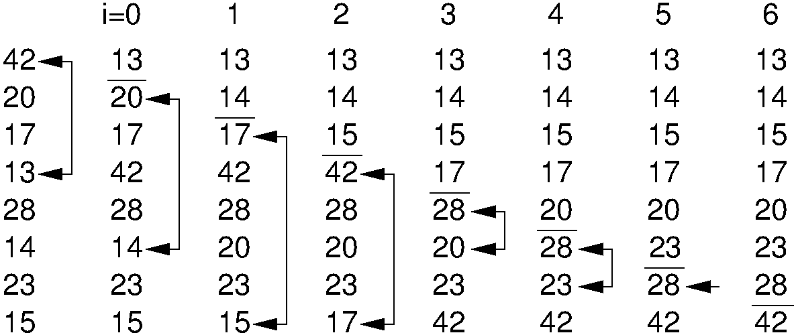

.. _SelectionSort:

.. index:: ! Selection Sort

Selection Sort
==============

Consider again the problem of sorting a pile of phone bills for the
past year.
Another intuitive approach might be to look through the pile until you
find the bill for January, and pull that out.
Then look through the remaining pile until you find the bill for
February, and add that behind January.
Proceed through the ever-shrinking pile of bills to select the next
one in order until you are done.
This is the inspiration for
our last :math:`\Theta(n^2)` sort,
called :dfn:`Selection Sort`.
The :math:`i`'th pass of Selection Sort "selects" the :math:`i`'th
smallest key in the array, placing that record into position
:math:`i`.
In other words, Selection Sort first finds the smallest key in an
unsorted list, then the second smallest, and so on.
Its unique feature is that there are few record swaps.
To find the next smallest key value requires searching through
the entire unsorted portion of the array, but only one swap is
required to put the record in place.
Thus, the total number of swaps required will be :math:`n-1`
(we get the last record in place "for free").

   <ODSAfig "SelSort" />
   An example of Selection Sort.
   Each column shows the array after the iteration with the indicated
   value of <code>i</code> in the outer ``for`` loop.
   Numbers above the line in each column have been sorted and are in
   their final positions.

Figure <ODSAref "SelSort" \> illustrates Selection Sort.

Here is an implementation for Selection Sort.

.. codeinclude:: Sorting/Selectionsort/Selectionsort.pde 
   :tag: Selectionsort

The following visualization puts it all together.

.. avembed:: AV/selectionsort-av.html

.. todo::
   :type: Exercise

   Given: An array where some element X is highlighted. Everthing to the
   left of X is sorted (the i smallest elements in the array, and
   everything to the right is 
   constrained random (must be bigger than the elements to the left).

   Question: In this array, the highlighted element shows the current
   position to start from to do the next pass of selection sort. Show
   the    array after this pass has been completed.

.. todo::
   :type: Proficiency Exercise

   Create proficiency exercise for Selection Sort.

Selection Sort (as written here) is essentially a Bubble Sort,
except that rather than repeatedly swapping adjacent values to get
the next smallest record into place, we instead remember the position
of the element to be selected and do one swap at the end.
Thus, the number of comparisons is still
:math:`\Theta(n^2)`,
but the number of swaps is much less than that required by bubble sort.
Selection Sort is particularly advantageous when the cost to do a swap
is high, for example, when the elements are long strings or other
large records.
Selection Sort is more efficient than Bubble Sort (by a constant
factor) in most other situations as well.

.. figure:: Images/PtrSwap.png
   :width: 400
   :alt: Swapping pointers to records

   <ODSAfig "PtrSwap" />
   An example of swapping pointers to records.
   (a) A series of four records.
   The record with key value 42 comes before the record with key value 5.
   (b) The four records after the top two pointers have been swapped.
   Now the record with key value 5 comes before the record with key
   value 42.

There is another approach to keeping the cost of swapping records low
that can be used by any sorting algorithm even when the records are
large.
This is to have each element of the array store a pointer to a record
rather than store the record itself.
In this implementation, a swap operation need only exchange the
pointer values; the records themselves do not move.
This technique is illustrated by Figure <ODSAref "PtrSwap" \>.
Additional space is needed to store the pointers, but the
return is a faster swap operation.

.. avembed:: Exercises/SelectionSortMC.html
   :showbutton: hide
   :title: Review Questions
