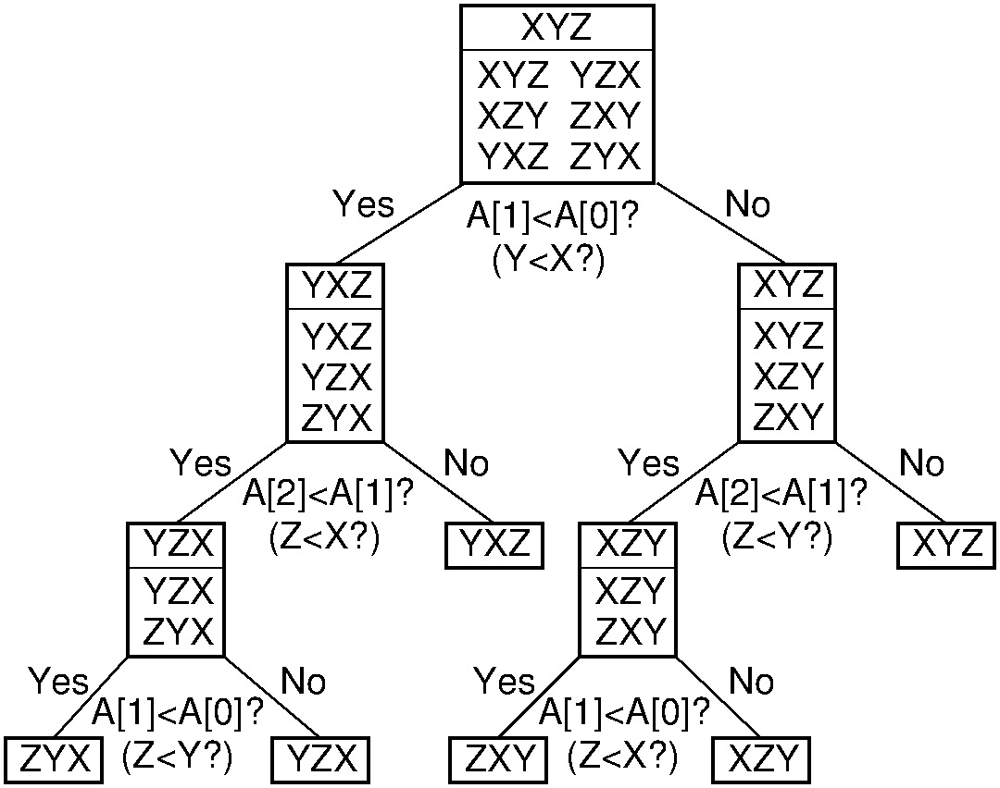

.. This file is part of the OpenDSA eTextbook project. See
.. http://algoviz.org/OpenDSA for more details.
.. Copyright (c) 2012 by the OpenDSA Project Contributors, and
.. distributed under an MIT open source license.

.. avmetadata:: SortingLowerBound
   :author: Cliff Shaffer
   :prerequisites: Sorting
   :topic: Sorting
   :short_name: SortingLowerBound

.. _SortingLowerBound:

.. include:: JSAVheader.rinc

.. index:: ! sorting; lower bounds proof

Lower Bounds for Sorting
========================

By now you have seen many analyses for algorithms.
These analyses generally define the upper and lower bounds for
algorithms in their worst and average cases.
For many of the algorithms presented so far, analysis has been easy.
This module considers a more difficult task: An analysis for
the cost of a *problem* as opposed to an *algorithm*.
The upper bound for a problem can be defined as the asymptotic cost of
the fastest known algorithm.
The lower bound defines the best possible efficiency for *any*
algorithm that solves the problem, including algorithms not yet
invented.
Once the upper and lower bounds for the problem meet, we know that no
future algorithm can possibly be (asymptotically) more efficient.

A simple estimate for a problem's lower bound can be obtained by
measuring the size of the input that must be read and the output
that must be written.
Certainly no algorithm can be more efficient than the problem's
I/O time.
From this we see that the sorting problem cannot be solved by
*any* algorithm in less than :math:`\Omega(n)` time because it
takes at least :math:`n` steps to read and write the :math:`n` values
to be sorted.
Alternatively, any sorting algorithm must at least look at every input
value to recognize whether the input values are in sorted order.
So, based on our current knowledge of sorting algorithms and the
size of the input, we know that the *problem* of sorting is
bounded by :math:`\Omega(n)` and :math:`O(n \log n)`.

Computer scientists have spent much time devising efficient
general-purpose sorting algorithms, but no one has ever found one
that is faster than :math:`O(n \log n)` in the worst or average
cases.
Should we keep searching for a faster sorting algorithm?
Or can we prove that there is no faster sorting algorithm by finding
a tighter lower bound?

This section presents one of the most important and most useful
proofs in computer science:
No sorting algorithm based on key comparisons can possibly be
faster than :math:`\Omega(n \log n)` in the worst case.
This proof is important for three reasons.
First, knowing that widely used sorting algorithms are asymptotically
optimal is reassuring.
In particular, it means that you need not bang your head against
the wall searching for an :math:`O(n)` sorting algorithm.
(Or at least not one that is in any way based on key comparisons.
But it is hard to imagine how to sort without any comparisons.
Even Radix Sort is does comparisons, though in quite a different way.)
Second, this proof is one of the few non-trivial lower-bounds proofs
that we have for any problem; that is, this proof provides one of the
relatively few instances where our lower bound is tighter than simply
measuring the size of the input and output.
As such, it provides a useful model for proving lower bounds on other
problems.
Finally, knowing a lower bound for sorting gives us a lower
bound in turn for other problems whose solution could be made to work
as the basis for a sorting algorithm.
The process of deriving asymptotic bounds for one problem from the
asymptotic bounds of another is called a :dfn:`reduction`,
a concept further explored in Module :numref:`<Reductions>`.

Except for the Radix Sort and Binsort, all of the sorting algorithms
we have studied make decisions based on the direct comparison of two
key values.
For example, Insertion Sort sequentially compares the value to be
inserted into the sorted list until a comparison against the next
value in the list fails.
In contrast, Radix Sort has no direct comparison of key values.
All decisions are based on the value of specific digits in the key
value,
so it is possible to take approaches to sorting that do not involve
direct key comparisons.
Of course, Radix Sort in the end does not provide a more efficient
sorting algorithm than comparison-based sorting.
Thus, empirical evidence suggests that comparison-based sorting is a
good approach.

(Actually, the truth is stronger than this statement implies.
In reality, Radix Sort relies on comparisons as well and so can be
modeled by the technique used in this section.
The result is an :math:`\Omega(n \log n)` bound in the general case
even for algorithms that look like Radix Sort.)

The proof that any comparison sort requires :math:`\Omega(n \log n)`
comparisons in the worst case is structured as follows.
First, comparison-based decisions can be modeled as the
branches in a tree.
This means that any sorting algorithm based on comparisons between
records can be viewed as a binary tree whose nodes correspond to the
comparisons, and whose branches correspond to the possible outcomes.
Next, the minimum number of leaves in the resulting tree is
shown to be the factorial of :math:`n`.
Finally, the minimum depth of a tree with :math:`n!` leaves is shown
to be in :math:`\Omega(n \log n)`.

Before presenting the proof of an :math:`\Omega(n \log n)` lower bound
for sorting, we first must define the concept of a
:dfn:`decision tree`.
A decision tree is a binary tree that can model the processing for any
algorithm that makes binary decisions.
Each (binary) decision is represented by a branch in the tree.
For the purpose of modeling sorting algorithms, we count all
comparisons of key values as decisions.
If two keys are compared and the first is less than the second, then
this is modeled as a left branch in the decision tree.
In the case where the first value is greater than the second, the
algorithm takes the right branch.

Figure :num:`Figure #Dectree` shows the decision tree that models
Sort Insertion on three input values.
The first input value is labeled X, the second Y, and the third Z.
They are initially stored in positions 0, 1, and 2, respectively,
of input array ``A``.
Consider the possible outputs.
Initially, we know nothing about the final positions of the three
values in the sorted output array.
The correct output could be any permutation of the input values.
For three values, there are :math:`n! = 6` permutations.
Thus, the root node of the decision tree lists all six permutations
that might be the eventual result of the algorithm.

.. _Dectree:

   A decision tree to model Insertion Sort when processing three values
   labeled X, Y, and Z, initially stored at positions 0, 1, and 2,
   respectively, in input array ``A``.

When :math:`n = 3`, the first comparison made by Insertion Sort
is between the second item in the input array (Y) and the first
item in the array (X).
There are two possibilities:
Either the value of Y is less than that
of X, or the value of Y is *not* less than that of X.
This decision is modeled by the first branch in the tree.
If Y is less than X, then the left branch should be taken and
Y must appear before X in the final output.
Only three of the original six permutations have this property,
so the left child of the root lists the three
permutations where Y appears before X: YXZ, YZX, and ZYX.
Likewise, if Y were not less than X, then the right branch would be
taken, and only the three permutations in which Y appears after X are
possible outcomes: XYZ, XZY, and ZXY.
These are listed in the right child of the root.

Let us assume for the moment that Y is less than X and so the
left branch is taken.
In this case, Insertion Sort swaps the two values.
At this point the array stores YXZ.
Thus, in Figure :num:`Figure #Dectree` the left child of the root
shows YXZ above the line.
Next, the third value in the array is compared against the second
(i.e., Z is compared with X).
Again, there are two possibilities.
If Z is less than X, then these items should be swapped (the left
branch).
If Z is not less than X, then Insertion Sort is complete (the right
branch).

Note that the right branch reaches a leaf node, and that this leaf node
contains only one permutation: YXZ.
This means that only permutation YXZ can be the outcome based
on the results of the decisions taken to reach this node.
In other words, Insertion Sort has "found" the single permutation
of the original input that yields a sorted list.
Likewise, if the second decision resulted in taking the left branch,
a third comparison, regardless of the outcome, yields nodes in the
decision tree with only single permutations.
Again, Insertion Sort has "found" the correct
permutation that yields a sorted list.

Any sorting algorithm based on comparisons can be modeled by a
decision tree in this way, regardless of the size of the input.
Thus, all sorting algorithms can be viewed as algorithms to "find"
the correct permutation of the input that yields a sorted list.
Each algorithm based on comparisons can be viewed as proceeding by
making branches in the tree based on the results of key comparisons,
and each algorithm can terminate once a node with a single permutation
has been reached.

How is the worst-case cost of an algorithm expressed by the
decision tree?
The decision tree shows the decisions made by an algorithm for all
possible inputs of a given size.
Each path through the tree from the root to a leaf is one possible
series of decisions taken by the algorithm.
The depth of the deepest node represents the longest series of
decisions required by the algorithm to reach an answer.

There are many comparison-based sorting algorithms, and each will be
modeled by a different decision tree.
Some decision trees might be well-balanced, others might be unbalanced.
Some trees will have more nodes than others (those with more nodes
might be making "unnecessary" comparisons).
In fact, a poor sorting algorithm might have an arbitrarily large
number of nodes in its decision tree, with leaves of arbitrary depth.
There is no limit to how slow the "worst" possible sorting
algorithm could be.
However, we are interested here in knowing what the *best*
sorting algorithm could have as its minimum cost in the worst
case.
In other words, we would like to know what is the *smallest*
depth possible for the *deepest* node in the tree for any
sorting algorithm.

The smallest depth of the deepest node will depend on the number of
nodes in the tree.
Clearly we would like to "push up" the nodes in the tree, but there
is limited room at the top.
A tree of height 1 can only store one node (the root);
the tree of height 2 can store three nodes; the tree of height 3 can
store seven nodes, and so on.

Here are some important facts worth remembering.

* A binary tree of height :math:`n` can store at most :math:`2^n-1`
  nodes.
* Equivalently, a tree with :math:`n` nodes requires at least
  :math:`\lceil \log (n+1) \rceil` levels.

What is the minimum number of nodes that must be in the decision tree
for any comparison-based sorting algorithm for :math:`n` values?
Because sorting algorithms are in the business of determining which
unique permutation of the input corresponds to the sorted list,
the decision tree for any sorting algorithm must contain at least one
leaf node for each possible permutation.
There are :math:`n!` permutations for a set of :math:`n` numbers.

Because there are at least :math:`n!` nodes in the tree, we know that
the tree must have :math:`\Omega(\log n!)` levels.
One way to find the value of :math:`\log n!` is from
Stirling's approximation, from which we can deduce that
:math:`\log n!` is in :math:`\Omega(n \log n)`.
The decision tree for any comparison-based sorting algorithm must
have nodes :math:`\Omega(n \log n)` levels deep.
Thus, in the worst case, any such sorting algorithm must require
:math:`\Omega(n \log n)` comparisons.

Any sorting algorithm requiring :math:`\Omega(n \log n)` comparisons
in the worst case requires :math:`\Omega(n \log n)` running time in
the worst case.
Because any sorting algorithm requires :math:`\Omega(n \log n)` running
time,
the problem of sorting also requires :math:`\Omega(n \log n)` time.
We already know of sorting algorithms with :math:`O(n \log n)` running
time, so we can conclude that the problem of sorting requires
:math:`\Theta(n \log n)` time.
As a corollary, we know that no comparison-based sorting algorithm can
improve on existing :math:`\Theta(n \log n)` time sorting algorithms by
more than a constant factor.
